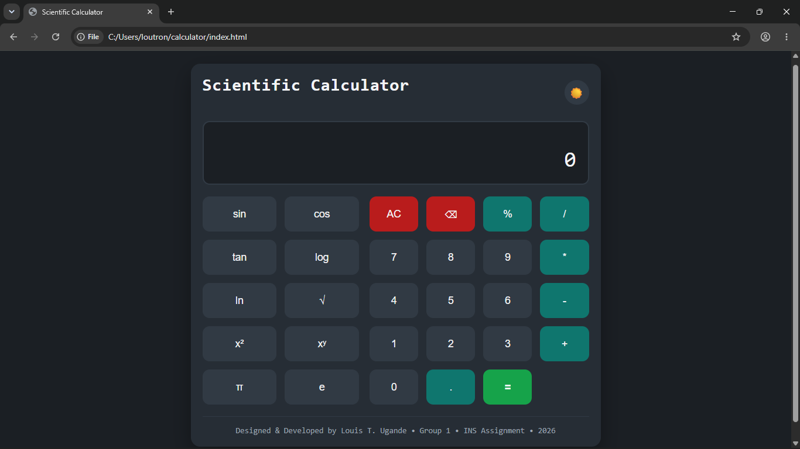

# 🧮 Scientific Calculator

A modern and responsive Scientific Calculator built with HTML, CSS, and JavaScript. This project combines both basic and scientific calculator functionalities into a single sleek interface with keyboard support, responsive design, and light/dark themes.

---

## ✨ Features

### Basic Calculator
- Addition
- Subtraction
- Multiplication
- Division
- Percentage
- Decimal support
- Clear (AC)
- Backspace

### Scientific Calculator
- Square Root (√)
- Square (x²)
- Power (xʸ)
- Sine (sin)
- Cosine (cos)
- Tangent (tan)
- Logarithm (log)
- Natural Logarithm (ln)
- π (Pi)
- Euler's Number (e)

### User Experience
- Responsive design
- Keyboard support
- Light & Dark mode
- Previous operation display
- Button press animations
- Error handling
- Mobile-friendly layout

---

## 📸 Preview



---

## 🛠️ Technologies Used

- HTML5
- CSS3
- JavaScript (ES6)

---

## ⌨️ Keyboard Shortcuts

| Key | Action |
|------|--------|
| 0-9 | Numbers |
| + | Addition |
| - | Subtraction |
| * | Multiplication |
| / | Division |
| . | Decimal |
| % | Percentage |
| Enter / = | Calculate |
| Backspace | Delete |
| Escape | Clear |

---

## 🚀 Getting Started

Clone the repository

```bash
git clone https://github.com/loutron000/calculator
```

Navigate into the project

```bash
cd calculator
```

Open `index.html` in your browser.

---

## 📂 Project Structure

```
calculator/
│
├── index.html
├── style.css
├── script.js
├── README.md
└── screenshot.png
```

---

## 🎯 Future Improvements

- Expression parser (e.g. `sin(45+30)`)
- Parentheses support
- Memory functions (M+, M-, MR, MC)
- Calculation history
- Copy result button
- Unit converter

---

## 👨‍💻 Author

**Louis T. Ugande**

Computer Science Student  
University of Jos

GitHub: https://github.com/loutron000

---

## 📄 License

This project was developed as part of an academic assignment and may be freely used for learning and educational purposes.